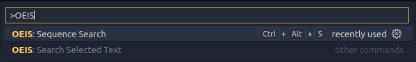
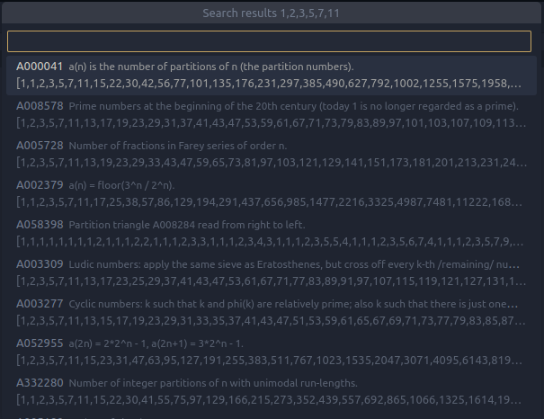
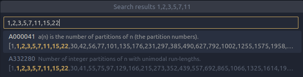
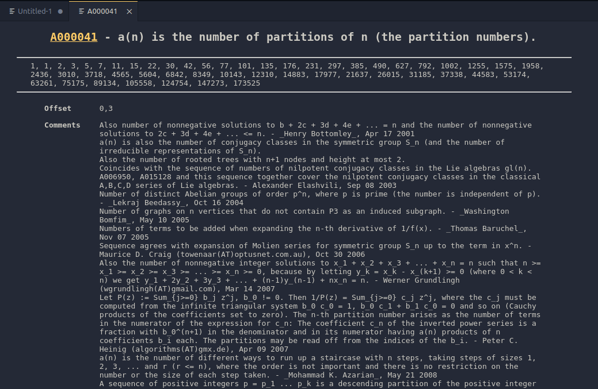
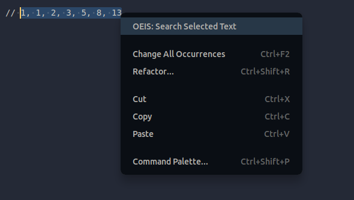

# OEIS

Allows basic searching of [OEIS](oeis.org) from VSCode

## Features

Allows searching for sequences in OEIS by running the `oeis.search` command:

View results of your search:

Filter results of your search:

Show sequence information in a new tab:

Highlight and right-click allows a quick search for a sequence from your editor.

Links to [OEIS](oeis.org) will also appear in the description to allow you to quickly navigate to the website.

## Usage

Hit Ctrl+Shift+P to open command palette and search for "OEIS".

After selecting the "OEIS: Sequence Search" command, just type any sequence like you would on the oeis website.

If any sequences are found, they will be displayed in a drop down with basic information. When you select one of those items, its description will open in a new window.

I recommend creating a key binding for the command. I'm currently using Ctrl+Alt+S.
